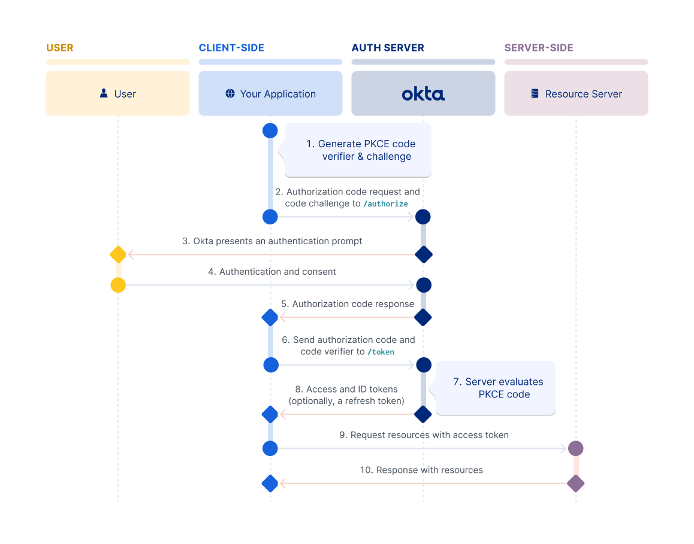

# OpenID Connect (OIDC)

- extends OAuth 2.0 with

  - user authentication and
  - Single Sign-On (SSO)
  - enables you to retreive and store authentication information about end users
  - defines several OAuth 2.0 scopes to enable applications to access user profile information

- defines an ID token type to pair with OAuth 2.0 access and refresh tokens
- standardizes scopes, endpoint discovery, and registration of clients (which OAuth 2.0 leaves up to choice)
- uses JWT tokens

## Roles

- **OpenID provider (OP)**: Authorization Server that issues the ID token (Google, Microsoft, Okta)
- **end user**
- **Relying party (RP)**: the client application that requests the ID token from the OP
- **ID token**: the token issued by the OP that contians information about the end user in the form of claims
- **claims**: the piece of information about the end user

## Overview

The OpenID Connect protocol, in abstract, follows the following steps.

1. The RP (Client) sends a request to the OpenID Provider (OP).
1. The OP authenticates the End-User and obtains authorization.
1. The OP responds with an ID Token and usually an Access Token.
1. The RP can send a request with the Access Token to the UserInfo Endpoint.
1. The UserInfo Endpoint returns Claims about the End-User.

These steps are illustrated in the following diagram:

```
+--------+                                   +--------+
|        |                                   |        |
|        |---------(1) AuthN Request-------->|        |
|        |                                   |        |
|        |  +--------+                       |        |
|        |  |        |                       |        |
|        |  |  End-  |<--(2) AuthN & AuthZ-->|        |
|        |  |  User  |                       |        |
|   RP   |  |        |                       |   OP   |
|        |  +--------+                       |        |
|        |                                   |        |
|        |<--------(3) AuthN Response--------|        |
|        |                                   |        |
|        |---------(4) UserInfo Request----->|        |
|        |                                   |        |
|        |<--------(5) UserInfo Response-----|        |
|        |                                   |        |
+--------+                                   +--------+
```

## Flows

| Property                                        | Authorization Code Flow | Implicit Flow | Hybrid Flow |
|-------------------------------------------------|-------------------------|---------------|-------------|
| All tokens returned from Authorization Endpoint | no                      | yes           | no          |
| All tokens returned from Token Endpoint         | yes                     | no            | no          |
| Tokens not revealed to User Agent               | yes                     | no            | no          |
| Client can be authenticated                     | yes                     | no            | yes         |
| Refresh Token possible                          | yes                     | no            | yes         |
| Communication in one round trip                 | no                      | yes           | no          |
| Most communication server-to-server             | yes                     | no            | varies      |

### Authorization Code Flow



### Implicit Flow

...

### Hybrid Flow

...

## Claims

This specification defines a set of standard Claims. They can be requested to be returned either in the UserInfo Response or in the ID token.

| Member                | Type    |
|-----------------------|---------|
| sub                   | string  |
| name                  | string  |
| given_name            | string  |
| family_name           | string  |
| middle_name           | string  |
| nickname              | string  |
| preferred_username    | string  |
| profile               | string  |
| picture               | string  |
| website               | string  |
| email                 | string  |
| email_verified        | boolean |
| gender                | string  |
| birthdate             | string  |
| zoneinfo              | string  |
| locale                | string  |
| phone_number          | string  |
| phone_number_verified | boolean |
| address               | JSON    |
| updated_at            | number  |

## Security Considerations

https://openid.net/specs/openid-connect-core-1_0.html#Security

# Resources

https://auth0.com/intro-to-iam/what-is-openid-connect-oidc
https://developer.okta.com/docs/concepts/oauth-openid/
https://openid.net/developers/how-connect-works/
https://openid.net/specs/openid-connect-core-1_0.html
